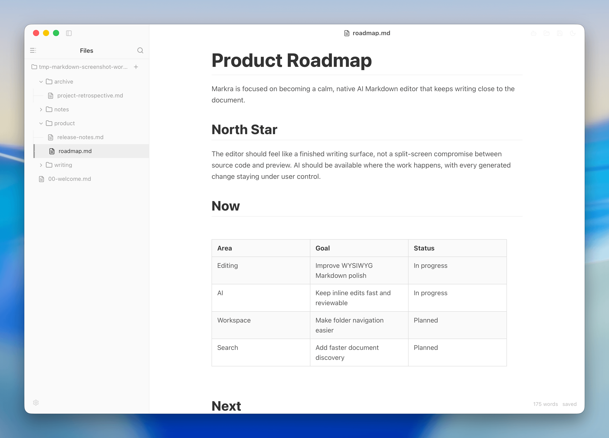
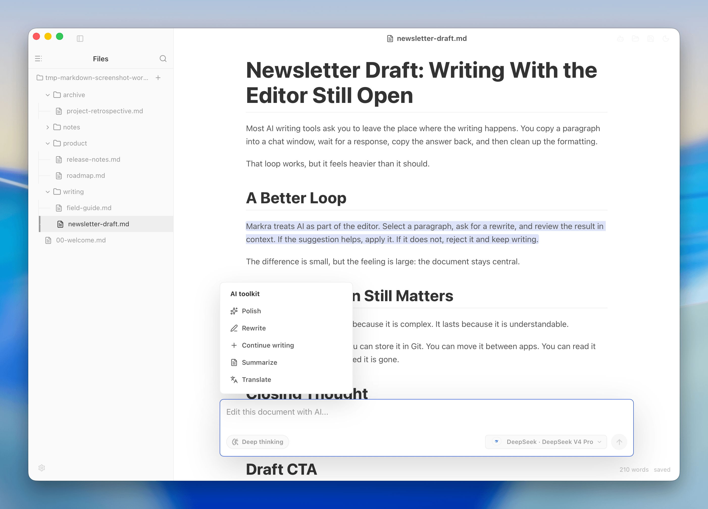
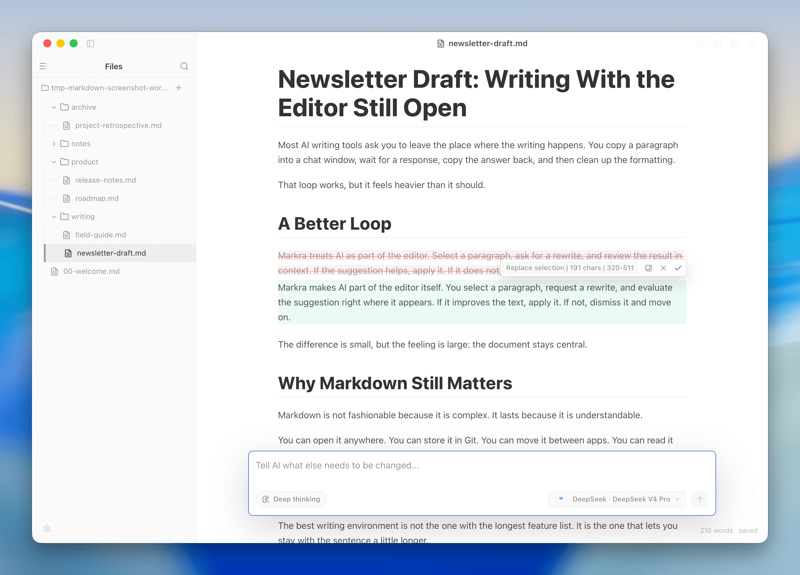
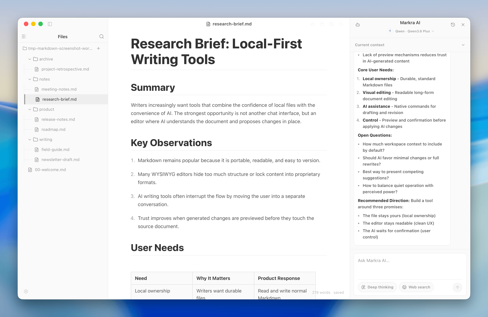
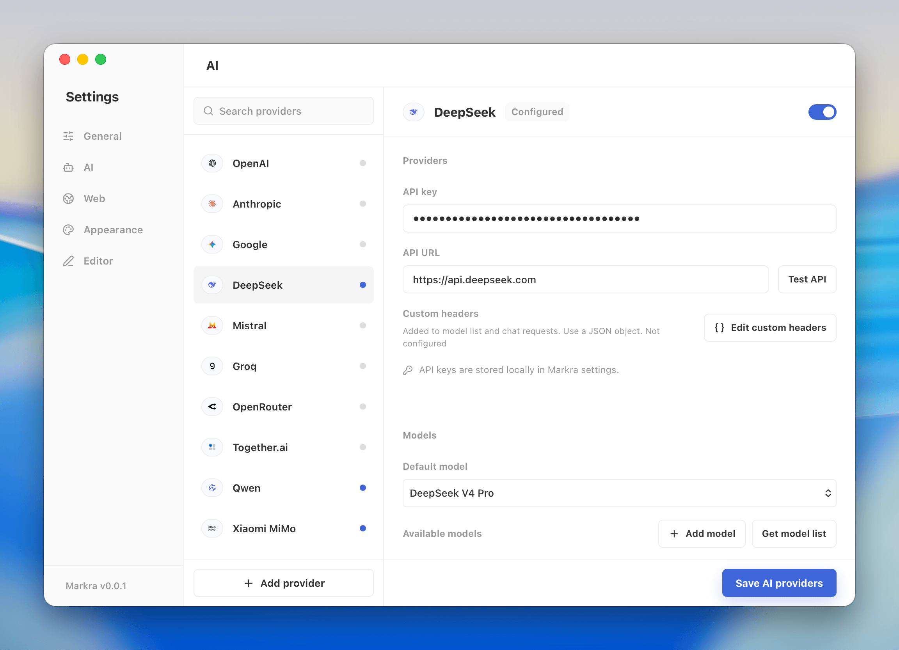

  

  <strong>A WYSIWYG Markdown editor with native AI.</strong>
   
  <strong>Fully open source. Free to use. Your data stays local.</strong>

  English | <a href="README.zh-CN.md">简体中文</a> | <a href="#download">Download</a> | <a href="#key-features">Key Features</a> | <a href="#roadmap">Roadmap</a> | <a href="#contributing">Contributing</a> | <a href="#license">License</a>

  
  
  
  
  
  

Markra is a fully open-source Markdown editor for local, WYSIWYG writing with native AI. It keeps your files as plain Markdown while adding block editing, document tabs, custom themes, export, and multi-provider AI.

Your files and workspace data stay on your device by default. Markra does not upload or sync your documents to a Markra server; AI and web search only send the context you choose through the providers you configure.

AI in Markra is part of the editor. It can use the current selection, document, outline, and nearby Markdown files to polish, rewrite, continue, summarize, or translate content. Write operations are previewed before anything changes.

## Screenshots

  

  <strong>WYSIWYG Markdown editing with local files and the document in one workspace.</strong>

| Native AI commands | Review AI edits |
| --- | --- |
|  |  |

| Markra AI side panel | Multi-provider AI settings |
| --- | --- |
|  |  |

## Download

Download the latest desktop builds from [GitHub Releases](https://github.com/murongg/markra/releases/latest): macOS Apple Silicon/Intel, Windows installer/portable, and Linux AppImage.

## Key Features

### 1. WYSIWYG Markdown

- Edit common Markdown, GFM tables, links, images, raw HTML, code blocks, and KaTeX math visually.
- Expand rendered links, images, HTML, and math back to source, or switch to full source mode.
- Tune writing width, font size, line height, and word-count/status display.

### 2. Blocks, Tables, and Code

- Use slash commands and side handles to add, move, and reorder blocks.
- Create GitHub-style callouts such as note, tip, important, warning, and caution.
- Adjust tables with visual row, column, size, and alignment controls.
- Choose code block languages, use syntax highlighting, and copy code blocks directly.

### 3. Native AI Support

- Use inline AI from selected text, or open the side panel for document and workspace tasks.
- Run quick actions for polish, rewrite, continue writing, summarize, and translate.
- Review AI edits as previews before applying, rejecting, or copying them.
- Search, rename, archive, restore, and delete AI sessions.
- Hand off complex inline prompts to the AI side panel when they need more context.

### 4. Local Markdown Workspace

- Open a single Markdown file or an entire Markdown folder.
- Browse, create, rename, and delete documents from the file tree.
- Keep multiple Markdown files open in document tabs and jump through the current document with the outline.
- Preview local images and insert relative Markdown links from double-bracket completion.
- Store pasted images locally, in S3, or in WebDAV.
- Keep save state, unsaved-change hints, and word count visible while writing.

### 5. Themes, Export, and Updates

- Pick built-in themes or write scoped custom CSS with import, export, and reset controls.
- Export the current document as standalone HTML or PDF with page, margin, header, footer, and metadata settings.
- Customize titlebar buttons and check for app updates from settings or the native app menu.

### 6. Providers and Web Search

Markra supports cloud models, local models, and OpenAI-compatible providers. You can choose separate models for inline editing and the AI side panel.

- OpenAI, Anthropic, Google Gemini, DeepSeek, Mistral, Groq, OpenRouter, Together.ai, Qwen, Xiaomi MiMo, Volcengine Ark, xAI, Azure OpenAI, and Ollama
- Custom OpenAI-compatible providers, custom request headers, provider-native web search, Bing, and SearXNG
- Search result and page-content limits so web access stays explicit and bounded

### 7. Open Source and Free

- Licensed under AGPL-3.0.
- Free to use, without putting core writing features behind a paywall.
- Transparent implementation and roadmap, with community contributions welcome.

## Use Cases

- Product docs, requirements, and release notes
- Blog posts, essays, newsletters, and interview notes
- Research notes, personal knowledge bases, and technical notes with tables, code, callouts, math, and local links
- Markdown drafts that need AI-aware polishing, restructuring, or expansion

## Philosophy

- Local first: your Markdown files and workspace data stay on your disk.
- Open source and free: core writing features stay inspectable and available.
- Writing first: file management, AI, settings, and web search should serve the document.
- Confirm before apply: AI edits appear as previews and wait for your confirmation.

## Roadmap

Markra is still evolving. The next areas of focus are:

- More stable Markdown workspace behavior
- More precise AI edit previews and conflict handling
- Faster full-text search, navigation, and knowledge organization
- Richer export templates, sharing workflows, and AI provider adapters

## Getting Started

1. Download Markra from [GitHub Releases](https://github.com/murongg/markra/releases/latest).
2. Open a Markdown file, or open a folder that contains Markdown files.
3. Start writing with the WYSIWYG editor, slash commands, block handles, or source mode.
4. Enable your preferred AI providers and models in settings.
5. Open the Markra AI side panel when you want help with the full document or workspace.

## Contributing

Markra welcomes improvements around product experience, Markdown editing, AI workflows, cross-platform desktop behavior, and documentation quality.

## License

Markra is licensed under AGPL-3.0.
